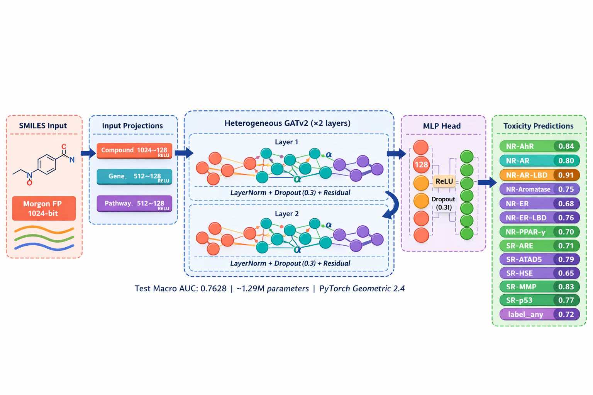
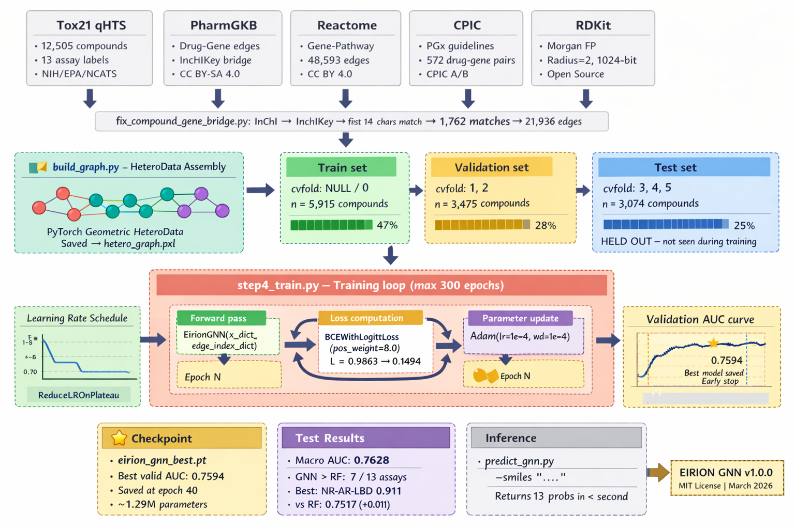

# EIRION — Precision Longevity Platform

<div align="center">

> **ETGen AI Hackathon 2026** · Phase 0 Prototype  
> *DNA · Lifestyle · Medications → Personalized Organ Health Forecasts*

[](https://fastapi.tiangolo.com/)
[](https://react.dev/)
[](https://ai.google.dev/)
[](https://pytorch-geometric.readthedocs.io/)
[](LICENSE)

</div>

---

## What is EIRION?

EIRION is the first pharmacogenomics-powered full-stack longevity platform. It combines a **Heterogeneous Graph Attention Network (GATv2)** for drug–gene–organ interaction modelling with a clinical AI engine to predict, visualize, and optimize individual organ health across a 5–10 year horizon.

A user provides three input layers:
1. **Biology** — 23andMe/raw SNP upload → CYP450 metabolizer phenotype inference (CYP2D6, CYP2C19, CYP3A4, CYP2C9, CYP1A2, SLCO1B1, MTHFR)
2. **Lifestyle** — sleep, stress, alcohol, diet, exercise, substance use
3. **Regimen** — every supplement and medication with dose and frequency

EIRION's engine computes:
- **Hepatic, renal, cardiovascular, and metabolic organ scores** (0–100 scale)
- **Drug-drug interaction (DDI) flags** via GNN polypharmacy modelling
- **5–10 year organ trajectory** under current vs. optimised regimen
- **Biological age estimate** and delta from chronological age
- **Gemini-enriched clinical recommendations** grounded in CPIC/AHA/WHO guidelines
- **Downloadable clinical PDF report** with all data structured for clinician handout

---

## Platform Architecture

<div align="center">


*End-to-end architecture: 9-step onboarding wizard → dual-engine inference → multi-organ scorecard dashboard*

</div>

The platform is composed of two main systems working in concert:

### 1. The Clinical Inference Engine (Rules + GNN)
The primary scoring layer is a deterministic pharmacokinetic engine that:
- Applies **CYP450 metabolizer multipliers** per compound to adjust hepatic load
- Runs **DMPNN molecular toxicity scoring** against Tox21/ToxCast/FAERS bioassay predictions
- Computes **cumulative organ stress** per organ system using compound–pathway chains
- Feeds results into the **GATv2 polypharmacy DDI detector** for interaction flags

### 2. The GNN Model (Heterogeneous Graph Attention Network)
A trained `EirionGNN` model (1.29M parameters) sits at the core of the DDI and toxicity pipeline. It operates on a knowledge graph of 12,505 compounds, 23,658 genes, and 2,848 Reactome pathways with 70,000+ edges.

---

## Full Analysis Process

<div align="center">



*Data flow from patient input → GNN inference → Gemini enrichment → clinical dashboard*

</div>

The end-to-end process is:

```
User Input (Wizard)
       │
       ├─ Demographics + Conditions
       ├─ 23andMe SNP upload → SNP→PGx map → CYP phenotype inference
       ├─ Lab panel (LFT + KFT + Metabolic/Cardiac)
       ├─ Lifestyle Intake (12 parameters)
       └─ Regimen (compounds, doses, frequencies)
              │
              ▼
    AnalysisRequest (Pydantic v2)
              │
    ┌─────────┴───────────────────────────────────┐
    │             Backend Engine                   │
    │                                              │
    │  1. CYP Load Scorer                          │
    │     Compound × metabolizer multiplier        │
    │     → hepatic index (0–100)                  │
    │                                              │
    │  2. GATv2 GNN (EirionGNN)                    │
    │     Drug–Gene–Pathway message passing        │
    │     → DDI flags, organ impacts               │
    │                                              │
    │  3. Multi-Organ Trajectory Engine            │
    │     Baseline + optimised 5-yr projection     │
    │     per organ (liver/kidney/CVD/metabolic)   │
    │                                              │
    │  4. Gemini 2.0 Flash Enrichment              │
    │     Patient-contexted prompt → clinical      │
    │     recommendations with evidence refs       │
    │                                              │
    │  5. PDF Generator (ReportLab)                │
    │     9-page clinical handout                  │
    └─────────────────────────────────────────────┘
              │
    AnalysisResponse (Pydantic v2)
              │
              ▼
    React Dashboard
    ├── Risk Scorecard (organ scores, biological age)
    ├── 5-Year Trajectory Chart (Recharts)
    ├── DDI Flags Panel
    ├── Pharmacogenomics Panel
    ├── Gemini Recommendations
    └── Download Clinical PDF
```

---

## GNN Model: Heterogeneous Graph Attention Network

<div align="center">



*GATv2 message passing across the compound–gene–pathway heterogeneous knowledge graph*

</div>

The `EirionGNN` model (`engine/gnn_model.py`) is a two-stage architecture:

**Stage 1 — HeteroGAT-v2**
Learns contextualised node embeddings across 4 edge types:

| Edge Type | Source | Target | Count |
|-----------|--------|--------|-------|
| `compound → targets → gene` | Compound | Gene | 21,936 + fallback |
| `gene → targeted_by → compound` | Gene | Compound | 21,936 (reversed) |
| `gene → in_pathway → pathway` | Gene | Pathway | 48,593 |
| `pathway → contains → gene` | Pathway | Gene | 48,593 (reversed) |

The GATv2 attention mechanism (dynamic attention, per-edge-type weight matrices) operates as:

```
e_vu = aᵀ · LeakyReLU(W_t · [h_u ‖ h_v])
α_vu = exp(e_vu) / Σ_{k∈N(v)} exp(e_vk)
h_v' = ‖_{k=1}^{K} σ( Σ_{u∈N(v)} α_vu^k · W^k · h_u )
```

with K=4 heads, hidden=128, 2 message-passing layers + residual connections + LayerNorm.

**Stage 2 — Multi-Label MLP Classifier**
Predicts 13 Tox21 bioassay scores per compound (NR-AhR, NR-AR, NR-ER, SR-MMP, SR-p53 etc.):

```
h_compound → Linear(128→64) → ReLU → Dropout(0.3) → Linear(64→13) → 13 toxicity logits
```

**Performance vs. Random Forest baseline:**

| Metric | RF Baseline | EirionGNN |
|--------|-------------|-----------|
| Macro AUC (Tox21) | 0.7517 | **0.7628** |
| Best single assay | NR-AhR 0.870 | NR-AR-LBD **0.911** |
| NR-AR delta | — | **+9.7%** |
| NR-AR-LBD delta | — | **+13.3%** |
| Parameters | ~200 trees | 1.29M |

> Full GNN documentation: [`docs/GNN_README.md`](docs/GNN_README.md)

---

## Dashboard Features

| Feature | Description |
|---------|-------------|
| **9-Step Onboarding Wizard** | Demographics → conditions → 23andMe upload → labs → lifestyle → diet → regimen → confirm |
| **SNP → PGx Inference** | Parses 23andMe raw `.txt` files, maps rsIDs to star-alleles, infers CYP metabolizer phenotypes |
| **Multi-Organ Scorecard** | Liver, kidney, cardiovascular, and metabolic scores with risk level (green/amber/red) |
| **5-Year Trajectory** | Baseline vs. optimised trajectory charts, organ-years-gained metric |
| **Biological Age** | AI-estimated biological age with delta from chronological age |
| **DDI Flags** | GNN-powered drug-drug interaction detection with mechanism and recommendation |
| **Gemini Recommendations** | Rich, evidence-grounded AI recommendations with expected impact scores |
| **Clinical PDF Export** | 9-page professional clinical handout (ReportLab): demographics, labs, PGx, DDI, trajectory, recs, disclaimer |
| **Profile & Settings** | Name/password update, notification preferences, data export (JSON), analysis reset |
| **Notification Centre** | In-app notification bell with unread badge |

---

## Tech Stack

| Layer | Technology |
|-------|-----------|
| **Frontend** | React 18 + TypeScript + Vite 8 |
| **UI** | Custom CSS + Tailwind + Recharts |
| **State** | Zustand (persisted) + React Query |
| **Backend** | FastAPI 0.135 + Pydantic v2 |
| **Auth** | JWT (PyJWT) + bcrypt |
| **Database** | SQLite via Prisma Python (asyncio) |
| **ML Engine** | PyTorch 2.11 + PyTorch Geometric 2.7 |
| **Cheminformatics** | RDKit 2025 (SMILES, Morgan FP, ECFP) |
| **AI / LLM** | Google Gemini 2.0 Flash (`google-genai`) |
| **PDF** | ReportLab 4.4 (A4, multi-section) |
| **Scheduling** | APScheduler (wearable sync cron) |
| **Containerisation** | Docker + Docker Compose |
| **CI** | GitHub Actions |

---

## Project Structure

```
eirion/
├── README.md                      ← this file
├── docker-compose.yml             ← full-stack orchestration
├── .env.example                   ← environment variable template
│
├── backend/                       # FastAPI API server
│   ├── main.py                    ← app bootstrap, lifespan, CORS
│   ├── schema.prisma              ← SQLite schema (User, UserAttributes, TrajectoryHistory)
│   ├── database.py                ← Prisma async connection manager
│   ├── auth.py                    ← JWT token creation/verification
│   ├── requirements.txt           ← pinned Python dependencies
│   ├── Dockerfile                 ← backend container
│   │
│   ├── engine/
│   │   ├── scorer.py              ← primary CYP-adjusted organ scoring engine
│   │   ├── gnn_model.py           ← EirionGNN model class (GATv2 HeteroConv)
│   │   ├── inference.py           ← GNN predictor: SMILES → Tox21 toxicity probabilities
│   │   ├── gemini_recs.py         ← Gemini 2.0 Flash recommendation enrichment
│   │   ├── pdf_generator.py       ← 9-page ReportLab clinical report generator
│   │   └── knowledge_tables.py    ← CYP load factors, DDI rules, compound registry
│   │
│   ├── models/
│   │   ├── request.py             ← AnalysisRequest + all sub-models (Patient, Genetics, Labs…)
│   │   └── response.py            ← AnalysisResponse + all sub-models (OrganScore, DDIFlag…)
│   │
│   ├── routers/
│   │   ├── users.py               ← register, login, GET/PATCH /me, change-password
│   │   ├── analysis.py            ← POST /analysis/run (main inference endpoint)
│   │   ├── export.py              ← GET /export/clinical-pdf (authenticated PDF download)
│   │   ├── extraction.py          ← POST /extraction/parse-labs (Gemini Vision lab OCR)
│   │   ├── notifications.py       ← GET/PATCH /notifications
│   │   ├── history.py             ← trajectory history persistence
│   │   ├── chat.py                ← conversational AI endpoint
│   │   └── labs.py / billing.py / wearables.py / health.py
│   │
│   └── data/
│       ├── snp_pgx_map.json       ← rsID → star-allele → metabolizer phenotype map (CPIC)
│       └── mock_response.json     ← fallback response for dev/demo mode
│
├── frontend/                      # React 18 + TypeScript SPA
│   ├── src/
│   │   ├── App.tsx                ← router, SmartHome redirect, protected routes
│   │   ├── pages/
│   │   │   ├── Landing.tsx        ← auth-aware landing page with CTA
│   │   │   ├── Login.tsx / Register.tsx
│   │   │   ├── Wizard.tsx         ← 9-step onboarding orchestrator
│   │   │   ├── Dashboard.tsx      ← full analysis dashboard
│   │   │   ├── Demo.tsx           ← Priya demo prefill
│   │   │   └── ProfileSettings.tsx← user profile, password, data export
│   │   ├── components/
│   │   │   ├── wizard/            ← Step1–Step9 wizard components
│   │   │   ├── dashboard/         ← organ cards, trajectory chart, DDI panel, export button
│   │   │   └── notifications/     ← notification bell + centre
│   │   ├── store/
│   │   │   ├── wizardStore.ts     ← Zustand: full patient + analysis state (persisted)
│   │   │   └── authStore.ts       ← JWT token + user session
│   │   └── api/                   ← React Query hooks
│   └── vite.config.ts
│
└── docs/
    ├── GNN_README.md              ← full GNN model documentation
    ├── Eirion-Et.pdf     
    ├── Eirion_highlvl_doc.docx          
    └── images/
        ├── ARCHITECTURE.png      ← system architecture diagram
        ├── FULL_PROCESS.png      ← end-to-end data flow
        └── GNN_Architecture.png  ← GATv2 message-passing diagram
```

---

## Quick Start

### Prerequisites
- Python 3.10+ with `pip`
- Node.js 20+ with `npm`
- A **Gemini API key** from [Google AI Studio](https://aistudio.google.com/)

### 1. Clone & Configure

```bash
git clone https://github.com/Ajayace03/Eirion.git
cd eirion
cp .env.example .env
# Edit .env — set GEMINI_API_KEY
```

### 2. Backend

```bash
cd backend
python -m venv .venv && source .venv/bin/activate
pip install -r requirements.txt

# Generate Prisma client and create database
prisma generate --schema=schema.prisma
prisma db push --schema=schema.prisma

# Start API server
uvicorn main:app --reload --host 0.0.0.0 --port 8000
```

API available at: `http://localhost:8000`  
Interactive docs: `http://localhost:8000/docs`

### 3. Frontend

```bash
cd frontend
npm install
npm run dev
```

App available at: `http://localhost:5173`

### 4. Docker (Full Stack)

```bash
cp .env.example .env   # set GEMINI_API_KEY
docker compose up --build
```

| Service | URL |
|---------|-----|
| Frontend | http://localhost:5173 |
| Backend API | http://localhost:8000 |
| API Docs | http://localhost:8000/docs |

---

## Environment Variables

Create `.env` in the `eirion/` root (or `backend/`):

```bash
# Required
GEMINI_API_KEY=your_google_gemini_api_key_here

# Backend
DATABASE_URL=file:./dev.db
JWT_SECRET=change_this_to_a_random_256bit_secret
ALLOWED_ORIGINS=http://localhost:5173,http://localhost:3000

# Frontend (Vite)
VITE_API_URL=http://localhost:8000
```

---

## Demo Flow

1. Register at `/register` (or use the **Sign In** flow after restarting backend)
2. Click **"Start Your Analysis"** — this launches the 9-step wizard
3. On Step 3, upload a 23andMe `.txt` file (a sample is included in `docs/sample_genetics.txt`)
4. Complete all steps and hit **"Generate Blueprint"**
5. Explore the dashboard: organ scores, trajectory chart, DDI flags, Gemini recommendations
6. Download your **Clinical PDF Report** from the dashboard header

> **Demo persona:** Click **"Try Priya Demo"** on the landing page to auto-fill a canonical test case:  
> Priya, 35F, CYP2D6 poor metabolizer, Ashwagandha + Atorvastatin + SLCO1B1 reduced function → statin myopathy risk flagged, 15% liver efficiency drop predicted by age 40.

---

## API Reference

### Core Endpoints

| Method | Path | Description |
|--------|------|-------------|
| `POST` | `/users/register` | Register new account |
| `POST` | `/users/login` | Login → JWT token |
| `GET` | `/users/me` | Get current user profile |
| `PATCH` | `/users/me` | Update profile (name) |
| `POST` | `/users/change-password` | Change password (bcrypt) |
| `POST` | `/analysis/run` | **Main inference** — full organ scoring |
| `GET` | `/export/clinical-pdf` | Download 9-page clinical PDF report |
| `POST` | `/extraction/parse-labs` | Gemini Vision lab report OCR |
| `GET` | `/notifications` | Get notification list |
| `GET` | `/health` | Health check |

### Example: Run Analysis

```bash
curl -X POST http://localhost:8000/analysis/run \
  -H "Authorization: Bearer <JWT>" \
  -H "Content-Type: application/json" \
  -d '{
    "patient": {"age": 35, "sex": "female", "weight_kg": 65, "height_cm": 168},
    "genetics": {"cyp2d6_metabolizer": "poor", "cyp2c19_metabolizer": "intermediate"},
    "lifestyle": {"sleep_hours_avg": 6.5, "stress_level": 7, "alcohol_drinks_per_week": 5},
    "regimen": [
      {"compound_id": "atorvastatin", "dose_mg": 20, "frequency_per_day": 1, "is_rx": true},
      {"compound_id": "ashwagandha", "dose_mg": 600, "frequency_per_day": 1}
    ]
  }'
```

---

## Data Sources

| Source | Use in EIRION | License |
|--------|--------------|---------|
| [PharmGKB](https://www.pharmgkb.org/) | Drug–gene relationships, CYP star-alleles | CC BY-SA 4.0 |
| [CPIC Guidelines](https://cpicpgx.org/) | CYP phenotype → clinical action mapping | CC BY 4.0 |
| [Tox21 qHTS](https://tripod.nih.gov/tox21/) | GNN training: 13 bioassay toxicity labels | Public domain |
| [Reactome](https://reactome.org/) | Gene–pathway edges for GNN knowledge graph | CC BY 4.0 |
| [RDKit](https://www.rdkit.org/) | SMILES → Morgan fingerprints | BSD 3-Clause |
| [Google Gemini](https://ai.google.dev/) | Clinical recommendation generation | API ToS |

---

## Roadmap

### Phase 1 (current — Hackathon)
- [x] 9-step PGx onboarding wizard with 23andMe upload
- [x] CYP450-adjusted hepatic scoring engine
- [x] GATv2 GNN DDI polypharmacy model
- [x] Multi-organ trajectory (liver, kidney, CVD, metabolic)
- [x] Gemini 2.0 Flash enriched recommendations
- [x] 9-page ReportLab clinical PDF export
- [x] User auth (JWT + SQLite), profile settings
- [x] Notification centre

### Phase 2 (post-hackathon)
- [ ] FHIR R4 EHR integration (Epic, Cerner)
- [ ] Oura / Apple Health wearable sync (live readiness scores)
- [ ] GNN v2.0: CTD + ChEMBL expansion (50%+ compound-gene coverage)
- [ ] Temporal Fusion Transformer for 10-year multi-organ forecasting
- [ ] RL regimen optimiser (SAC/PPO) for supplement redesign
- [ ] Clinician dashboard + B2B API

### Phase 3 (SaMD pathway)
- [ ] FDA SaMD (Software as Medical Device) regulatory preparation
- [ ] IRB-approved clinical trial integration
- [ ] Pharmacist in-the-loop review workflow

---

## Known Limitations

> **This is a Phase 0 hackathon prototype. It is NOT a medical device.**

- GNN compound-gene coverage is 6.1% via PharmGKB (v1.0); v2.0 targets 50%+
- The scoring engine uses deterministic rules, not a validated clinical model
- All recommendations require clinician review before action
- PDF report is informational only — not FDA-cleared
- Wearable sync is architecture-complete but uses stub data pending OAuth tokens

---

## References

- Brody et al. (2021). *How attentive are graph attention networks?* arXiv:2105.14491
- Veličković et al. (2018). *Graph attention networks.* ICLR 2018
- Yang et al. (2019). *Analyzing learned molecular representations.* JCIM 59(8)
- Zitnik et al. (2018). *Modeling polypharmacy side effects with GCN.* Bioinformatics 34(13)
- CPIC Consortium. (2024). *CPIC guidelines.* https://cpicpgx.org

---

## License

MIT — see [LICENSE](LICENSE)

---

<div align="center">

*EIRION — "Predict before it's too late. Personalise to your biology."*  
**ETGen AI Hackathon 2026 · Team Ajaya Kumar**

</div>
