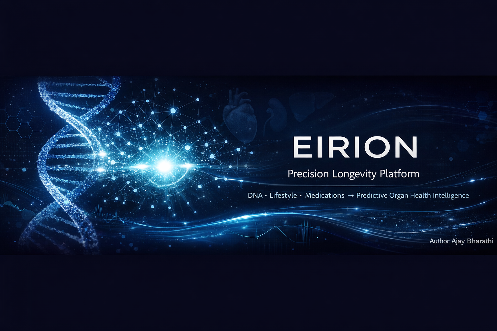
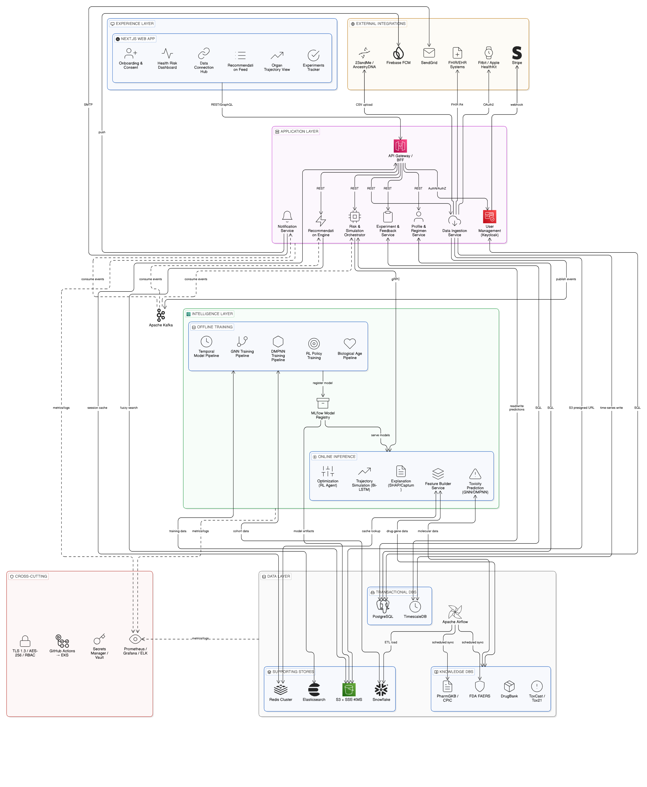

<p align="center">
  
</p>

<div align="center">

# EIRION — Precision Longevity Platform

### 🧬 DNA · 💊 Lifestyle · 🩺 Medications → Personalized Organ Health Forecasts

[](https://fastapi.tiangolo.com/)
[](https://react.dev/)
[](https://ai.google.dev/)
[](https://pytorch-geometric.readthedocs.io/)
[](LICENSE)

**ETGen AI Hackathon 2026** · Phase 0 Prototype · **Team Ajay Bharathi**

[Quick Start](#-quick-start) · [Architecture](#-platform-architecture) · [GNN Model](#-gnn-model-heterogeneous-graph-attention-network) · [Dashboard](#-dashboard-features) · [API Reference](#-api-reference) · [Roadmap](#-roadmap)

</div>

---

## 📋 Table of Contents

- [What is EIRION?](#-what-is-eirion)
- [Platform Demo](#-platform-demo)
- [Platform Architecture](#-platform-architecture)
- [Full Analysis Process](#-full-analysis-process)
- [GNN Model: Heterogeneous Graph Attention Network](#-gnn-model-heterogeneous-graph-attention-network)
- [Dashboard Features](#-dashboard-features)
- [Tech Stack](#-tech-stack)
- [Project Structure](#-project-structure)
- [Quick Start](#-quick-start)
- [Environment Variables](#-environment-variables)
- [Demo Flow](#-demo-flow)
- [API Reference](#-api-reference)
- [Data Sources & Datasets](#-data-sources--datasets)
- [Roadmap](#-roadmap)
- [Known Limitations](#-known-limitations)
- [References](#-references)
- [License](#-license)

---

## 🧬 What is EIRION?

**EIRION** is the first pharmacogenomics-powered full-stack longevity platform. It combines a **Heterogeneous Graph Attention Network (GATv2)** for drug–gene–organ interaction modelling with a clinical AI engine to predict, visualize, and optimize individual organ health across a **5–10 year horizon**.

A user provides three input layers:

| Input Layer | What You Provide | What EIRION Does |
|-------------|------------------|------------------|
| **🧬 Biology** | 23andMe / raw SNP upload | CYP450 metabolizer phenotype inference (CYP2D6, CYP2C19, CYP3A4, CYP2C9, CYP1A2, SLCO1B1, MTHFR) |
| **🏃 Lifestyle** | Sleep, stress, alcohol, diet, exercise, substance use | Quantifies organ stress from lifestyle factors |
| **💊 Regimen** | Every supplement & medication with dose and frequency | Drug-drug interaction analysis + cumulative organ load scoring |

### What EIRION Computes

- 🫀 **Hepatic, renal, cardiovascular, and metabolic organ scores** (0–100 scale)
- ⚠️ **Drug-drug interaction (DDI) flags** via GNN polypharmacy modelling
- 📈 **5–10 year organ trajectory** under current vs. optimised regimen
- 🧓 **Biological age estimate** and delta from chronological age
- 🤖 **Gemini-enriched clinical recommendations** grounded in CPIC/AHA/WHO guidelines
- 📄 **Downloadable 9-page clinical PDF report** structured for clinician handout

---

## 🎬 Platform Demo

<div align="center">

https://github.com/user-attachments/assets/eirion_platform_demo.mp4

<video src="docs/videos/eirion_platform_demo.mp4" width="800" controls>
  Your browser does not support the video tag.
</video>

*Full end-to-end demonstration: Registration → 9-step wizard → Analysis → Dashboard → PDF Export*

</div>

> **🎯 Try the demo persona:** Click **"Try Priya Demo"** on the landing page to auto-fill a canonical test case:
> 
> *Priya, 35F, CYP2D6 poor metabolizer, Ashwagandha + Atorvastatin + SLCO1B1 reduced function → statin myopathy risk flagged, 15% liver efficiency drop predicted by age 40.*

---

## 🏗 Platform Architecture

<div align="center">



*End-to-end architecture: Experience Layer → Application Layer → Intelligence Layer → Data Layer*

</div>

The platform is composed of **five architectural layers**:

### Experience Layer (Frontend)
The React 19 + TypeScript SPA provides:
- **Onboarding Wizard** — guided 9-step patient data collection
- **Health Risk Dashboard** — multi-organ scorecard with interactive visualizations
- **Recommendation Feed** — AI-enriched clinical advice
- **Organ Trajectory View** — 5-year multi-timeframe projection charts
- **Data Connection Hub** — 23andMe upload, lab OCR, wearable sync

### Application Layer (API Gateway)
FastAPI 0.135 serves as the API gateway with:
- **RESTful endpoints** for all platform features
- **JWT authentication** with bcrypt password hashing
- **Notification service** for asynchronous alerts
- **Data ingestion** service for genetic file parsing and lab OCR

### Intelligence Layer (ML/AI Engine)
The core inference pipeline:
- **GATv2 GNN** (1.29M parameters) — compound toxicity prediction across 13 Tox21 assays
- **CYP450 scoring engine** — deterministic pharmacokinetic rules with genetic multipliers
- **Gemini 2.5 Flash** — patient-contextualised clinical recommendation generation
- **Multi-organ trajectory projector** — 5-year organ health forecasting

### Data Layer
- **SQLite via Prisma** — user accounts, attributes, trajectory history
- **PharmGKB / CPIC** — curated drug-gene relationships
- **Tox21 / Reactome** — bioassay labels and biological pathway data
- **RDKit** — molecular structure processing (SMILES → Morgan fingerprints)

---

## 🔄 Full Analysis Process

<div align="center">


*Complete data pipeline: Data sources → Graph construction → Training → Inference → EIRION GNN v1.0.0*

</div>

### End-to-End Pipeline

```
User Input (9-Step Wizard)
       │
       ├─ Step 1: Demographics (age, sex, weight, height, ethnicity)
       ├─ Step 2: Pre-existing conditions (diabetes, CKD, hypertension, etc.)
       ├─ Step 3: 23andMe SNP upload → SNP→PGx map → CYP phenotype inference
       ├─ Step 4: Manual genetic entry (CYP2D6, CYP2C19, CYP3A4, etc.)
       ├─ Step 5: Lab panel — upload image (Gemini Vision OCR) or manual entry
       │          └── LFT (ALT, AST, GGT, ALP, Albumin)
       │          └── KFT (eGFR, Creatinine, BUN)
       │          └── Metabolic (HbA1c, Fasting Glucose)
       │          └── Cardiac (LDL, HDL, Triglycerides, hsCRP)
       ├─ Step 6: Lifestyle — sleep, stress, alcohol, exercise, smoking, toxins
       ├─ Step 7: Diet — calories, macros, fiber, processed food %, diet type
       ├─ Step 8: Regimen — every supplement & medication with dose + frequency
       └─ Step 9: Confirmation & submission
              │
              ▼
    AnalysisRequest (Pydantic v2 — fully validated)
              │
    ┌─────────┴───────────────────────────────────────┐
    │              Backend Engine                       │
    │                                                   │
    │  1. CYP450 Load Scorer (scorer.py — 887 lines)   │
    │     Compound × metabolizer multiplier × dose      │
    │     → per-compound hepatic load (0–100 scale)     │
    │     → lifestyle penalties (sleep, stress, sugar)   │
    │     → food penalties (processed food, fiber, etc.) │
    │                                                   │
    │  2. GATv2 GNN (EirionGNN — 1.29M params)         │
    │     SMILES → Morgan FP → GATv2 → 13 Tox21 probs  │
    │     Drug–Gene–Pathway message passing (2-hop)     │
    │     → DDI flags with mechanism explanations       │
    │     → organ-level toxicity impact scores          │
    │                                                   │
    │  3. Multi-Organ Knowledge Graph (28K lines)       │
    │     Condition penalties → organ loads              │
    │     Compound → gene → pathway chains              │
    │     CYP genetic multipliers per compound          │
    │                                                   │
    │  4. Multi-Organ Trajectory Projector              │
    │     Baseline + optimised 5-yr projection          │
    │     per organ (liver/kidney/CVD/metabolic)        │
    │     Recommendation delta simulation               │
    │                                                   │
    │  5. Gemini 2.5 Flash Enrichment                   │
    │     Full patient context prompt (CYP panel,       │
    │     organ scores, labs, regimen with DDI notes)   │
    │     → Mechanistically specific, personalized      │
    │       clinical recommendations with evidence      │
    │                                                   │
    │  6. PDF Generator (ReportLab — 47K)               │
    │     9-page A4 clinical handout                    │
    └───────────────────────────────────────────────────┘
              │
    AnalysisResponse (Pydantic v2)
              │
              ▼
    React Dashboard (14 widgets)
    ├── Multi-Organ Scorecard (liver, kidney, CVD, metabolic)
    ├── 5-Year Trajectory Chart (baseline vs optimised)
    ├── Multi-Timeframe Projection Chart
    ├── Biological Age Widget (with chronological delta)
    ├── Risk Summary Card
    ├── DDI Flags Panel (mechanism + recommendation)
    ├── Compound→Gene→Pathway Chain Panel
    ├── Compound Contribution Breakdown
    ├── Gemini Recommendation Feed
    ├── Circadian / Sleep Panel
    ├── Guideline Reference Panel (CPIC/AHA/WHO)
    ├── Progress Tracking Chart
    ├── Clinical PDF Export Button
    └── Compound Cart (current regimen)
```

---

## 🧠 GNN Model: Heterogeneous Graph Attention Network

<div align="center">


*EirionGNN: SMILES input → Morgan FP → Input projections → 2-layer GATv2 with residual connections → MLP head → 13 Tox21 toxicity predictions*

</div>

The `EirionGNN` model ([`engine/gnn_model.py`](backend/engine/gnn_model.py)) is a two-stage architecture with **1.29M trainable parameters**:

### Stage 1 — HeteroGAT-v2

Learns contextualised node embeddings across a heterogeneous knowledge graph using **4 edge types**:

| Edge Type | Source → Target | Count | Data Source |
|-----------|-----------------|-------|-------------|
| `compound → targets → gene` | Compound → Gene | 21,936 + fallback | PharmGKB via InChIKey bridge |
| `gene → targeted_by → compound` | Gene → Compound | 21,936 (reversed) | PharmGKB |
| `gene → in_pathway → pathway` | Gene → Pathway | 48,593 | Reactome (Homo sapiens) |
| `pathway → contains → gene` | Pathway → Gene | 48,593 (reversed) | Reactome |

### Knowledge Graph Statistics

| Node Type | Count | Feature Dim | Feature Source |
|-----------|-------|-------------|----------------|
| **Compound** | 12,505 | 1024 | Morgan fingerprint (radius=2, RDKit) |
| **Gene** | 23,658 | 512 | Truncated one-hot identity |
| **Pathway** | 2,848 | 512 | Truncated one-hot identity |
| **Total edges** | **70,000+** | — | PharmGKB + Reactome |

### GATv2 Attention Mechanism

The dynamic attention (Brody et al. 2021) computes per-edge-type attention coefficients:

```
e_vu = aᵀ · LeakyReLU(W_t · [h_u ‖ h_v])
α_vu = exp(e_vu) / Σ_{k∈N(v)} exp(e_vk)
h_v' = ‖_{k=1}^{K} σ( Σ_{u∈N(v)} α_vu^k · W^k · h_u )
```

Config: **K=4 heads**, **hidden=128**, **2 message-passing layers** + residual connections + LayerNorm + Dropout(0.3)

### Stage 2 — Multi-Label MLP Classifier

Predicts 13 Tox21 bioassay toxicity scores per compound:

```
h_compound → Linear(128→64) → ReLU → Dropout(0.3) → Linear(64→13) → 13 toxicity logits
```

**Target Assays:**

| Category | Assays | Biological Relevance |
|----------|--------|---------------------|
| **Nuclear Receptor** | NR-AhR, NR-AR, NR-AR-LBD, NR-Aromatase, NR-ER, NR-ER-LBD, NR-PPAR-γ | Endocrine disruption, hormone signalling, CYP induction |
| **Stress Response** | SR-ARE, SR-ATAD5, SR-HSE, SR-MMP, SR-p53 | Oxidative stress, genotoxicity, mitochondrial toxicity, DNA damage |
| **Composite** | label_any | Overall toxicity flag |

### Performance — GNN vs. Random Forest Baseline

| Metric | RF Baseline | EirionGNN | Delta |
|--------|-------------|-----------|-------|
| **Macro AUC (13 assays)** | 0.7517 | **0.7628** | **+1.5%** |
| Best single assay | NR-AhR 0.870 | NR-AR-LBD **0.911** | — |
| NR-AR improvement | — | — | **+9.7%** |
| NR-AR-LBD improvement | — | — | **+13.3%** |
| Parameters | ~200 trees | 1.29M | — |
| Training time (CPU) | ~8 min | ~40 min | — |

<details>
<summary><b>📊 Full Per-Assay Results (click to expand)</b></summary>

| Assay | GNN AUC | RF AUC | Delta |
|-------|---------|--------|-------|
| NR-AhR | 0.8423 | 0.8696 | -0.0273 |
| NR-AR | 0.7961 | 0.6987 | **+0.0974** |
| NR-AR-LBD | **0.9110** | 0.7782 | **+0.1328** |
| NR-Aromatase | 0.7506 | 0.7947 | -0.0441 |
| NR-ER | 0.6845 | 0.6471 | +0.0374 |
| NR-ER-LBD | 0.7629 | 0.7435 | +0.0194 |
| NR-PPAR-γ | 0.6962 | 0.7519 | -0.0557 |
| SR-ARE | 0.7074 | 0.7144 | -0.0070 |
| SR-ATAD5 | 0.7891 | 0.7471 | +0.0420 |
| SR-HSE | 0.6542 | 0.6703 | -0.0161 |
| SR-MMP | 0.8306 | 0.8522 | -0.0216 |
| SR-p53 | 0.7697 | 0.7643 | +0.0054 |
| label_any | 0.7222 | 0.7402 | -0.0180 |
| **Macro avg** | **0.7628** | **0.7517** | **+0.0111** |

</details>

### Training Configuration

| Parameter | Value |
|-----------|-------|
| Optimizer | Adam (lr=1e-4, weight_decay=1e-4) |
| LR Scheduler | ReduceLROnPlateau (factor=0.5, patience=5) |
| Loss | BCEWithLogitsLoss (pos_weight=8.0 per task) |
| Gradient clipping | 1.0 (L2 norm) |
| Batch size | Full graph (transductive) |
| Max epochs | 300 (early stop at 240) |
| Best checkpoint | Epoch 40 (valid AUC 0.7594) |

> 📖 **Full GNN documentation:** [`docs/GNN_README.md`](docs/GNN_README.md) — 760 lines covering mathematical foundations, layer-by-layer description, InChIKey bridge construction, dataset details, and v2.0 development plans.

---

## 🖥 Dashboard Features

| Feature | Description |
|---------|-------------|
| **🧙 9-Step Onboarding Wizard** | Demographics → conditions → 23andMe upload → genetic manual entry → lab upload/entry → lifestyle → diet → regimen → confirm |
| **🧬 SNP → PGx Inference** | Parses 23andMe raw `.txt` files, maps rsIDs to star-alleles, infers CYP450 metabolizer phenotypes for 7 genes |
| **🫀 Multi-Organ Scorecard** | Liver, kidney, cardiovascular, and metabolic scores (0–100) with risk level colouring (green/amber/red) |
| **📈 5-Year Trajectory** | Baseline vs. optimised trajectory charts with organ-years-gained metric |
| **📊 Multi-Timeframe Projection** | Extended organ health projections across multiple timeframes |
| **🧓 Biological Age** | AI-estimated biological age with delta from chronological age |
| **⚠️ DDI Flags** | GNN-powered drug-drug interaction detection with mechanism explanation and clinical recommendation |
| **🔬 Compound→Gene→Pathway Chains** | Visual chain showing how each compound flows through genes to organ pathways |
| **🤖 Gemini Recommendations** | Rich, evidence-grounded AI recommendations personalized to CYP genotype, organ scores, and labs |
| **🩻 Lab OCR Upload** | Upload lab report images — Gemini Vision extracts structured lab values automatically |
| **📄 Clinical PDF Export** | 9-page professional A4 clinical handout (ReportLab): demographics, labs, PGx, DDI, trajectory, recs, disclaimer |
| **💬 AI Chat** | Gemini-powered conversational AI for health questions in patient context |
| **⚙️ Profile & Settings** | Name/password update, notification preferences, data export (JSON), analysis reset |
| **🔔 Notification Centre** | In-app notification bell with unread badge and notification management |
| **🛒 Compound Cart** | Live view of current supplement/medication stack with per-compound organ impacts |
| **💳 Pro Features** | Paywall overlay for premium features (wearable sync, advanced projections) |

---

## ⚡ Tech Stack

| Layer | Technology | Version |
|-------|-----------|---------|
| **Frontend Framework** | React + TypeScript | 19.2 + TS 5.9 |
| **Build Tool** | Vite | 8.0 |
| **Styling** | Tailwind CSS | 4.2 |
| **State Management** | Zustand (persisted) | 5.0 |
| **Data Fetching** | Axios + React Query patterns | 1.14 |
| **Charts** | Recharts | 3.8 |
| **Animations** | Framer Motion | 12.38 |
| **Icons** | Lucide React | 1.7 |
| **Routing** | React Router DOM | 7.13 |
| **Toasts** | React Hot Toast | 2.6 |
| | | |
| **Backend Framework** | FastAPI + Pydantic v2 | 0.135 + 2.12 |
| **ASGI Server** | Uvicorn | 0.42 |
| **Auth** | PyJWT + bcrypt | 2.12 + 5.0 |
| **Database ORM** | Prisma Python (asyncio) | 0.15 |
| **Database** | SQLite | — |
| | | |
| **ML Framework** | PyTorch | 2.11 |
| **Graph ML** | PyTorch Geometric | 2.7 |
| **Cheminformatics** | RDKit | 2025.9 |
| **ML Utilities** | scikit-learn + NumPy + SciPy | 1.7 + 2.2 + 1.15 |
| | | |
| **AI / LLM** | Google Gemini (google-genai) | 1.69 |
| **PDF Generation** | ReportLab + Pillow | 4.4 + 12.1 |
| **Scheduling** | APScheduler | 3.11 |
| **HTTP Client** | HTTPX | 0.28 |
| **Containerisation** | Docker + Docker Compose | — |

---

## 📁 Project Structure

```
eirion/
├── README.md                          ← this file
├── docker-compose.yml                 ← full-stack Docker orchestration
├── .env.example                       ← environment variable template
├── .gitignore                         ← git ignore rules
│
├── backend/                           # ═══ FastAPI API Server ═══
│   ├── main.py                        ← app bootstrap, lifespan, CORS, 11 routers
│   ├── schema.prisma                  ← SQLite schema (User, UserAttributes, TrajectoryHistory)
│   ├── database.py                    ← Prisma async connection manager
│   ├── auth.py                        ← JWT token creation/verification + bcrypt
│   ├── requirements.txt               ← pinned Python dependencies (44 packages)
│   ├── Dockerfile                     ← backend container image
│   ├── dev.db                         ← SQLite development database
│   │
│   ├── engine/                        # ─── The Brain ───
│   │   ├── __init__.py                ← engine package init
│   │   ├── scorer.py                  ← 🏆 PRIMARY: CYP-adjusted multi-organ scoring (887 lines)
│   │   ├── gnn_model.py               ← EirionGNN: GATv2 HeteroConv model class (1.29M params)
│   │   ├── inference.py               ← GNN predictor: SMILES → Morgan FP → 13 Tox21 probabilities
│   │   ├── knowledge.py               ← CYP load factors, DDI rules, compound registry tables
│   │   ├── knowledge_graph.py         ← Compound→gene→pathway knowledge graph (28K)
│   │   ├── graph_builder.py           ← PyTorch Geometric HeteroData graph builder
│   │   ├── projector.py               ← Multi-organ 5-year trajectory projector
│   │   ├── gemini_recs.py             ← Gemini 2.5 Flash recommendation enrichment
│   │   ├── pdf_generator.py           ← 9-page A4 ReportLab clinical report (47K)
│   │   │
│   │   ├── weights/                   # Trained model checkpoints
│   │   │   └── eirion_gnn_best.pt     ← GATv2 GNN checkpoint (2.17 MB, best valid AUC 0.7594)
│   │   │
│   │   └── planned/                   # Phase 2/3 modules (designed, not yet live)
│   │       ├── __init__.py            ← planned module index
│   │       ├── bio_age_tracker.py     ← advanced biological age tracking
│   │       ├── dmpnn_toxicity.py      ← D-MPNN molecular toxicity encoder
│   │       ├── gatv2_drug_gene_organ.py ← extended GATv2 drug→gene→organ model
│   │       ├── multi_organ_expansion.py ← expanded organ system support
│   │       ├── rl_regimen_optimizer.py  ← RL (SAC/PPO) regimen optimizer
│   │       ├── tft_forecasting.py     ← Temporal Fusion Transformer (10-yr forecast)
│   │       └── wearable_fhir_integration.py ← FHIR R4 + Oura/Apple Health sync
│   │
│   ├── models/                        # ─── Pydantic v2 Data Models ───
│   │   ├── __init__.py                ← model exports
│   │   ├── request.py                 ← AnalysisRequest + Patient, Genetics, Labs, Lifestyle, Regimen
│   │   └── response.py               ← AnalysisResponse + OrganScore, DDIFlag, Trajectory, Recommendation
│   │
│   ├── routers/                       # ─── API Endpoints (11 routers) ───
│   │   ├── __init__.py                ← router exports
│   │   ├── users.py                   ← register, login, GET/PATCH /me, change-password
│   │   ├── analysis.py                ← POST /analysis/run — main inference endpoint
│   │   ├── export.py                  ← GET /export/clinical-pdf — authenticated PDF download
│   │   ├── extraction.py              ← POST /extraction/parse-labs — Gemini Vision lab OCR
│   │   ├── notifications.py           ← GET/PATCH /notifications
│   │   ├── history.py                 ← trajectory history persistence
│   │   ├── chat.py                    ← conversational AI endpoint
│   │   ├── labs.py                    ← lab data management
│   │   ├── billing.py                 ← billing/subscription (Pro features)
│   │   ├── wearables.py               ← Oura Ring / wearable sync endpoints
│   │   └── health.py                  ← health check endpoint
│   │
│   ├── data/                          # ─── Static Reference Data ───
│   │   ├── snp_pgx_map.json          ← rsID → star-allele → metabolizer phenotype map (CPIC)
│   │   └── mock_response.json        ← fallback response for dev/demo mode
│   │
│   └── tests/                         # ─── Test Suite ───
│       ├── __init__.py
│       └── test_engine.py             ← scoring engine unit tests (17K)
│
├── frontend/                          # ═══ React 19 + TypeScript SPA ═══
│   ├── index.html                     ← HTML entrypoint
│   ├── package.json                   ← npm dependencies and scripts
│   ├── vite.config.ts                 ← Vite build configuration
│   ├── tsconfig.json                  ← TypeScript configuration
│   ├── eslint.config.js               ← ESLint rules
│   ├── Dockerfile                     ← frontend container image
│   │
│   └── src/
│       ├── main.tsx                   ← React DOM render entry
│       ├── App.tsx                    ← router, SmartHome redirect, protected routes, header
│       ├── App.css                    ← global application styles
│       ├── index.css                  ← base CSS reset and tokens
│       ├── types.ts                   ← full TypeScript type definitions (8K)
│       │
│       ├── pages/                     # ─── Page Components ───
│       │   ├── Landing.tsx            ← auth-aware landing page with hero + CTA
│       │   ├── Login.tsx              ← login form → JWT token
│       │   ├── Register.tsx           ← registration (email + name + password)
│       │   ├── Wizard.tsx             ← 9-step onboarding orchestrator
│       │   ├── Dashboard.tsx          ← full analysis dashboard (14 widgets)
│       │   ├── Demo.tsx               ← "Priya Demo" — pre-filled canonical test case (26K)
│       │   └── ProfileSettings.tsx    ← user profile, password, data export, reset
│       │
│       ├── components/
│       │   ├── wizard/                # ─── 13 Wizard Step Components ───
│       │   │   ├── Step1Demographics.tsx
│       │   │   ├── Step2Conditions.tsx
│       │   │   ├── Step2Genetics.tsx
│       │   │   ├── Step3GeneticUpload.tsx  ← 23andMe .txt file parser
│       │   │   ├── Step3Lifestyle.tsx
│       │   │   ├── Step3Diet.tsx
│       │   │   ├── Step4GeneticManual.tsx
│       │   │   ├── Step4Regimen.tsx
│       │   │   ├── Step5LabUpload.tsx     ← Gemini Vision OCR for lab reports
│       │   │   ├── Step5Labs.tsx
│       │   │   ├── Step6Lifestyle.tsx     ← deep lifestyle intake (15K)
│       │   │   ├── Step6Confirm.tsx
│       │   │   └── Step8Regimen.tsx       ← compound entry with search (13K)
│       │   │
│       │   ├── dashboard/             # ─── 14 Dashboard Widgets ───
│       │   │   ├── OrganScorecard.tsx          ← 4-organ score cards with risk colours
│       │   │   ├── TrajectoryChart.tsx         ← 5-year baseline vs optimised (Recharts)
│       │   │   ├── MultiTimeframeChart.tsx     ← extended projection chart (10K)
│       │   │   ├── BiologicalAgeWidget.tsx     ← bio age display with delta
│       │   │   ├── RiskSummaryCard.tsx         ← headline risk summary
│       │   │   ├── RecommendationFeed.tsx      ← Gemini AI recommendation cards
│       │   │   ├── CompoundCart.tsx            ← current regimen display
│       │   │   ├── CompoundContributions.tsx   ← per-compound load breakdown
│       │   │   ├── PathwayChainPanel.tsx       ← drug→gene→pathway chain viz
│       │   │   ├── GuidelinePanel.tsx          ← CPIC/AHA/WHO guideline refs
│       │   │   ├── CircadianPanel.tsx          ← circadian/sleep analysis
│       │   │   ├── ClinicianExportButton.tsx   ← PDF download button
│       │   │   ├── PaywallOverlay.tsx          ← Pro feature paywall
│       │   │   └── ProgressChart.tsx           ← health progress tracking
│       │   │
│       │   ├── notifications/         # ─── Notification System ───
│       │   │   └── NotificationBell.tsx       ← bell icon + unread badge + dropdown
│       │   │
│       │   └── chat/                  # ─── AI Chat Interface ───
│       │       └── (chat components)
│       │
│       ├── store/                     # ─── Zustand State Stores ───
│       │   ├── wizardStore.ts         ← full patient + analysis state (persisted)
│       │   ├── authStore.ts           ← JWT token + user session
│       │   └── notificationStore.ts   ← notification state + unread count
│       │
│       └── api/                       # ─── API Layer ───
│           ├── analysis.ts            ← analysis API hooks
│           └── mock_response.json     ← client-side fallback for offline/demo
│
└── docs/                              # ═══ Documentation ═══
    ├── GNN_README.md                  ← full GNN documentation (760 lines, 37K)
    ├── Eirion-ET.pdf                  ← hackathon submission PDF (1.1 MB)
    ├── Eirion_highlvl_doc.docx        ← high-level project documentation
    │
    ├── images/
    │   ├── Banner_Eirion.png          ← project banner (1.8 MB)
    │   ├── ARCHITECTURE.png           ← system architecture diagram (561 KB)
    │   ├── FULL_PROCESS.png           ← end-to-end data flow diagram (738 KB)
    │   └── GNN_Architecture.png       ← GATv2 model architecture diagram (1.1 MB)
    │
    └── videos/
        └── eirion_platform_demo.mp4   ← full platform demo video (18 MB)
```

### File Statistics

| Component | Files | Lines of Code (est.) | Key Highlights |
|-----------|-------|---------------------|----------------|
| Backend Engine | 10 | ~3,500 | scorer.py (887 lines), pdf_generator.py (1,200+ lines) |
| Backend Routers | 12 | ~1,000 | 11 API routers covering all platform features |
| Backend Models | 3 | ~400 | Pydantic v2 request/response models |
| Backend Tests | 2 | ~400 | Scoring engine unit tests |
| Backend Planned | 8 | ~2,000 | Phase 2/3 modules (designed, not live) |
| Frontend Pages | 7 | ~1,800 | Demo.tsx (26K — full demo scenario) |
| Frontend Wizard | 13 | ~2,800 | 9-step onboarding flow |
| Frontend Dashboard | 14 | ~1,700 | 14 interactive dashboard widgets |
| Frontend State | 3 | ~300 | Zustand persisted stores |
| Documentation | 3 | ~800 | GNN_README.md (760 lines) |
| **Total** | **~97** | **~14,700** | — |

---

## 🚀 Quick Start

### Prerequisites

| Requirement | Version |
|-------------|---------|
| Python | 3.10+ |
| Node.js | 20+ |
| npm | 10+ |
| Gemini API Key | [Get from Google AI Studio](https://aistudio.google.com/) |

### 1. Clone & Configure

```bash
git clone https://github.com/Ajayace03/Eirion.git
cd eirion
cp .env.example .env
# Edit .env — set GEMINI_API_KEY (required)
# Optionally set JWT_SECRET for production
```

### 2. Backend

```bash
cd backend

# Create virtual environment
python -m venv .venv

# Activate (Linux/macOS)
source .venv/bin/activate
# Activate (Windows)
.\.venv\Scripts\Activate.ps1

# Install dependencies
pip install -r requirements.txt

# Generate Prisma client and create database
prisma generate --schema=schema.prisma
prisma db push --schema=schema.prisma

# Start API server
uvicorn main:app --reload --host 0.0.0.0 --port 8000
```

> 🟢 **API available at:** `http://localhost:8000`  
> 📖 **Interactive docs:** `http://localhost:8000/docs`

### 3. Frontend

```bash
cd frontend
npm install
npm run dev
```

> 🟢 **App available at:** `http://localhost:5173`

### 4. Docker (Full Stack — One Command)

```bash
cp .env.example .env   # set GEMINI_API_KEY
docker compose up --build
```

| Service | URL |
|---------|-----|
| 🌐 Frontend | http://localhost:5173 |
| ⚡ Backend API | http://localhost:8000 |
| 📖 API Docs (Swagger) | http://localhost:8000/docs |

---

## 🔐 Environment Variables

Create `.env` in the `eirion/` root (shared by both backend and frontend):

```bash
# ─── Required ────────────────────────────────────────────────────────────────
GEMINI_API_KEY=your_google_gemini_api_key_here

# ─── Backend ─────────────────────────────────────────────────────────────────
DATABASE_URL=file:./dev.db
JWT_SECRET=change_this_to_a_random_256bit_secret    # Generate: python -c "import secrets; print(secrets.token_hex(32))"
ALLOWED_ORIGINS=http://localhost:5173,http://localhost:3000

# ─── Frontend (Vite) ────────────────────────────────────────────────────────
VITE_API_URL=http://localhost:8000
```

---

## 🎮 Demo Flow

1. **Register** at `/register` — create an account with email, name, and password
2. Click **"Start Your Analysis"** — launches the 9-step onboarding wizard
3. **Step 1–2:** Enter demographics and pre-existing conditions
4. **Step 3:** Upload a 23andMe `.txt` file for automatic CYP phenotype inference
5. **Step 4:** Or manually enter genetic metabolizer statuses
6. **Step 5:** Upload lab report image (Gemini Vision OCR) or enter values manually
7. **Step 6–7:** Complete lifestyle and diet questionnaires
8. **Step 8:** Enter your full supplement/medication stack with doses
9. **Step 9:** Confirm and hit **"Generate Blueprint"**
10. **Explore the dashboard:** organ scores, trajectory chart, DDI flags, Gemini recommendations
11. **Download** your **Clinical PDF Report** from the dashboard header

> **🎯 Quick Demo:** Click **"Try Priya Demo"** on the landing page to instantly see a fully populated analysis without entering any data.

---

## 📡 API Reference

### Authentication

All protected endpoints require a Bearer token in the `Authorization` header:
```
Authorization: Bearer <JWT_TOKEN>
```

### Endpoints

#### Auth & User Management

| Method | Path | Auth | Description |
|--------|------|------|-------------|
| `POST` | `/users/register` | ❌ | Register new account (email, full_name, password) |
| `POST` | `/users/login` | ❌ | Login → returns JWT token |
| `GET` | `/users/me` | ✅ | Get current user profile + attributes |
| `PATCH` | `/users/me` | ✅ | Update profile (full_name) |
| `POST` | `/users/change-password` | ✅ | Change password (requires current password, bcrypt) |

#### Core Analysis

| Method | Path | Auth | Description |
|--------|------|------|-------------|
| `POST` | `/analysis/run` | ✅ | **Main inference** — runs full multi-organ scoring pipeline |
| `POST` | `/extraction/parse-labs` | ✅ | Gemini Vision lab report OCR (image → structured values) |
| `GET` | `/export/clinical-pdf` | ✅ | Download 9-page clinical PDF report |

#### Supporting Features

| Method | Path | Auth | Description |
|--------|------|------|-------------|
| `GET` | `/notifications` | ✅ | Get notification list with unread status |
| `PATCH` | `/notifications/{id}/read` | ✅ | Mark notification as read |
| `GET` | `/history` | ✅ | Get trajectory history (past analyses) |
| `POST` | `/chat/message` | ✅ | Send message to Gemini AI chat |
| `GET` | `/labs` | ✅ | Get stored lab values |
| `GET` | `/wearables/sync` | ✅ | Trigger wearable data sync |
| `GET` | `/billing/status` | ✅ | Get subscription status |
| `GET` | `/health` | ❌ | Health check (returns service status) |

### Example: Run Analysis

```bash
curl -X POST http://localhost:8000/analysis/run \
  -H "Authorization: Bearer <JWT>" \
  -H "Content-Type: application/json" \
  -d '{
    "patient": {
      "age": 35,
      "sex": "female",
      "weight_kg": 65,
      "height_cm": 168,
      "ethnicity": "south_asian"
    },
    "genetics": {
      "cyp2d6_metabolizer": "poor",
      "cyp2c19_metabolizer": "intermediate",
      "cyp3a4_metabolizer": "normal",
      "cyp2c9_metabolizer": "normal",
      "cyp1a2_metabolizer": "unknown",
      "slco1b1_function": "reduced",
      "mthfr_c677t": "heterozygous"
    },
    "conditions": [
      {"condition_id": "hyperlipidemia"}
    ],
    "lifestyle": {
      "sleep_hours_avg": 6.5,
      "stress_level": 7,
      "alcohol_drinks_per_week": 5,
      "exercise_mins_per_week": 90,
      "sugar_g_per_day": 120,
      "smoking_status": "never",
      "environmental_toxin_exposure": 3,
      "processed_food_frequency": 5
    },
    "regimen": [
      {"compound_id": "atorvastatin", "dose_mg": 20, "frequency_per_day": 1, "is_rx": true},
      {"compound_id": "ashwagandha", "dose_mg": 600, "frequency_per_day": 1},
      {"compound_id": "vitamin_d", "dose_mg": 2000, "frequency_per_day": 1},
      {"compound_id": "omega_3", "dose_mg": 2000, "frequency_per_day": 1}
    ]
  }'
```

### Example Response (abbreviated)

```json
{
  "risk_summary": {
    "risk_level": "amber",
    "liver_index_now": 67.5,
    "projected_drop_percent": 12.3,
    "headline": "Moderate liver stress detected — index 68/100. Projected to decline ~12% by year 5."
  },
  "organ_scores": [
    {"organ": "liver", "score": 67.5, "risk_level": "amber", "top_driver": "Atorvastatin"},
    {"organ": "kidney", "score": 82.1, "risk_level": "green", "top_driver": "Lifestyle"},
    {"organ": "cardiovascular", "score": 71.3, "risk_level": "amber", "top_driver": "High Stress"},
    {"organ": "metabolic", "score": 74.8, "risk_level": "amber", "top_driver": "High Sugar Diet"}
  ],
  "biological_age": 39.8,
  "ddi_flags": [
    {
      "compound_a": "atorvastatin",
      "compound_b": "ashwagandha",
      "severity": "moderate",
      "mechanism": "CYP3A4 competitive inhibition increases statin exposure"
    }
  ],
  "trajectory": [
    {"year": 0, "liver_index": 67.5, "optimized_liver_index": 67.5},
    {"year": 5, "liver_index": 59.2, "optimized_liver_index": 72.1}
  ],
  "recommendations": [
    {
      "action_type": "swap",
      "title": "Replace Ashwagandha with Rhodiola Rosea",
      "details": "Your CYP2D6 poor-metabolizer status increases ashwagandha hepatic load by 40%..."
    }
  ]
}
```

---

## 📊 Database Schema

The backend uses **SQLite via Prisma** with three models:

```prisma
model User {
  id                  String    @id @default(cuid())
  email               String    @unique
  full_name           String
  hashed_password     String
  onboarding_complete Boolean   @default(false)
  is_pro              Boolean   @default(false)
  oura_token          String?
  created_at          DateTime  @default(now())
  attributes          UserAttributes?
  history             TrajectoryHistory[]
}

model UserAttributes {
  id                  String @id @default(cuid())
  user_id             String @unique
  age                 Int
  sex                 String
  weight_kg           Float
  height_cm           Float?
  ethnicity           String?
  cyp2d6_metabolizer  String @default("unknown")
  cyp2c19_metabolizer String @default("unknown")
}

model TrajectoryHistory {
  id         String   @id @default(cuid())
  user_id    String
  score      Int
  snapshot   String   // JSON string of AnalysisResponse
  created_at DateTime @default(now())
}
```

---

## 📚 Data Sources & Datasets

| Source | Use in EIRION | Records | License |
|--------|--------------|---------|---------|
| [**Tox21 qHTS**](https://tripod.nih.gov/tox21/) | GNN training: 13 bioassay toxicity labels | 12,505 compounds | Public domain (US Gov) |
| [**PharmGKB**](https://www.pharmgkb.org/) | Drug–gene relationships, CYP star-alleles, InChIKey bridge | 21,936 compound-gene edges | CC BY-SA 4.0 |
| [**CPIC Guidelines**](https://cpicpgx.org/) | CYP phenotype → clinical action mapping | 572 drug-gene pairs | CC BY 4.0 |
| [**Reactome**](https://reactome.org/) | Gene–pathway edges for GNN knowledge graph | 48,593 gene-pathway edges (2,848 pathways) | CC BY 4.0 |
| [**RDKit**](https://www.rdkit.org/) | SMILES → Morgan fingerprints (1024-bit, radius=2) | — | BSD 3-Clause |
| [**Google Gemini**](https://ai.google.dev/) | Clinical recommendation generation + Lab OCR | — | API ToS |

---

## 🗺 Roadmap

### Phase 1 ✅ (Current — Hackathon)

- [x] 9-step PGx onboarding wizard with 23andMe upload
- [x] CYP450-adjusted hepatic scoring engine (7 CYP enzymes)
- [x] GATv2 GNN DDI polypharmacy model (1.29M params, 0.76 AUC)
- [x] Multi-organ trajectory (liver, kidney, CVD, metabolic)
- [x] Gemini 2.5 Flash enriched recommendations
- [x] Gemini Vision lab report OCR
- [x] 9-page ReportLab clinical PDF export
- [x] User auth (JWT + SQLite + Prisma), profile settings
- [x] Notification centre with unread badge
- [x] AI chat endpoint
- [x] Docker Compose full-stack deployment
- [x] Comprehensive documentation (README + GNN_README)

### Phase 2 🔮 (Post-Hackathon)

- [ ] **FHIR R4 EHR integration** (Epic, Cerner) — see `planned/wearable_fhir_integration.py`
- [ ] **Oura / Apple Health wearable sync** — live readiness scores via OAuth
- [ ] **GNN v2.0:** CTD + ChEMBL expansion (50%+ compound-gene coverage)
  - CTD chemical-gene linkage via PubChem CAS numbers
  - ChEMBL bioactivity data (pChEMBL ≥ 5)
  - Tanimoto structural similarity inference for unlinked compounds
  - Node2Vec gene embeddings (replace one-hot)
  - Edge feature encoding (PK/PD flags, CPIC level, evidence source)
- [ ] **Temporal Fusion Transformer** for 10-year multi-organ forecasting — see `planned/tft_forecasting.py`
- [ ] **RL regimen optimiser** (SAC/PPO) for supplement redesign — see `planned/rl_regimen_optimizer.py`
- [ ] **Advanced biological age tracking** — see `planned/bio_age_tracker.py`
- [ ] **D-MPNN molecular encoder** — see `planned/dmpnn_toxicity.py`
- [ ] Clinician dashboard + B2B API

### Phase 3 🏥 (SaMD Pathway)

- [ ] FDA SaMD (Software as Medical Device) regulatory preparation
- [ ] IRB-approved clinical trial integration
- [ ] Pharmacist in-the-loop review workflow
- [ ] Multi-drug interaction modelling (DrugBank DDI dataset)
- [ ] Attention-based explainability dashboard (GATv2 attention weights → clinical rationale)

---

## ⚠️ Known Limitations

> **🔬 This is a Phase 0 hackathon prototype. It is NOT a medical device.**

| Limitation | Detail | Mitigation |
|-----------|---------|------------|
| **GNN compound-gene coverage** | 6.1% via PharmGKB (758/12,505 compounds) | v2.0 targets 50%+ via CTD + ChEMBL expansion |
| **Deterministic scoring** | Organ scores use rule-based models, not validated clinical models | Gemini enrichment adds clinical context; future versions use ML throughout |
| **Clinician review required** | All recommendations require professional review before action | Disclaimer shown in app and PDF report |
| **PDF not FDA-cleared** | Clinical PDF is informational only | Phase 3 targets SaMD regulatory pathway |
| **Wearable sync stub** | Architecture-complete but uses mock data | Pending OAuth token integration for Oura/Apple Health |
| **No stereochemistry** | Morgan FP (radius=2) doesn't capture enantiomer differences | v2.0 considers D-MPNN molecular encoder |
| **CPU-only tested** | GNN trained and deployed on CPU | CUDA/MPS should work with no code changes |

---

## 📖 References

1. Brody, S., Alon, U., and Yahav, E. (2021). *How attentive are graph attention networks?* arXiv:2105.14491
2. Veličković, P., Cucurull, G., Casanova, A., Romero, A., Liò, P., and Bengio, Y. (2018). *Graph attention networks.* ICLR 2018
3. Yang, K., Swanson, K., Jin, W. et al. (2019). *Analyzing learned molecular representations for property prediction.* JCIM 59(8), 3370–3388
4. Zitnik, M., Agrawal, M., and Leskovec, J. (2018). *Modeling polypharmacy side effects with graph convolutional networks.* Bioinformatics 34(13), i457–i466
5. CPIC Consortium. (2024). *Clinical Pharmacogenomics Implementation Consortium guidelines.* https://cpicpgx.org
6. Davis, A. P. et al. (2023). *Comparative Toxicogenomics Database (CTD): Update 2023.* NAR 51(D1), D1257–D1262
7. Huang, R. et al. (2011). *Chemical genomics profiling of environmental chemical modulation of human nuclear receptors.* EHP 119(8), 1142–1148
8. Fey, M. and Lenssen, J. E. (2019). *Fast graph representation learning with PyTorch Geometric.* ICLR Workshop
9. Rogers, D. and Hahn, M. (2010). *Extended-connectivity fingerprints.* JCIM 50(5), 742–754

---

## 📄 License

MIT — see [LICENSE](LICENSE)

---

<div align="center">

### *EIRION — "Predict before it's too late. Personalise to your biology."*

**ETGen AI Hackathon 2026 · Built by Ajay Bharathi**

---

<sub>

</sub>

</div>
